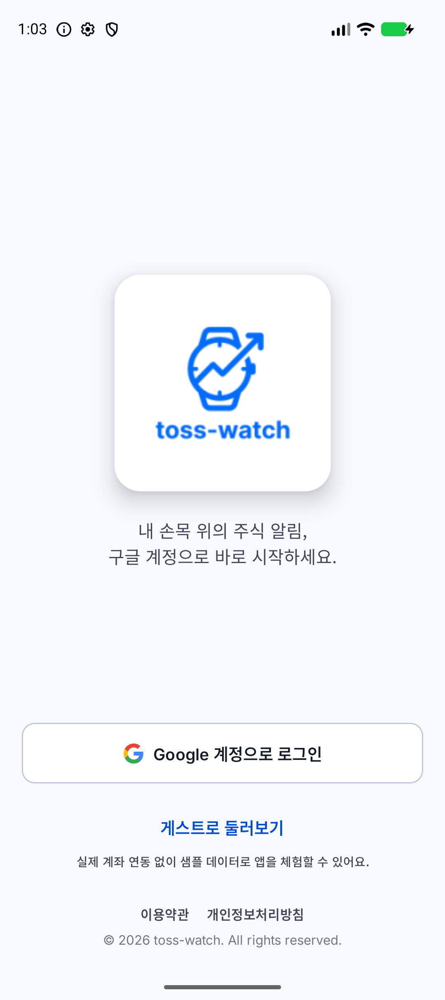
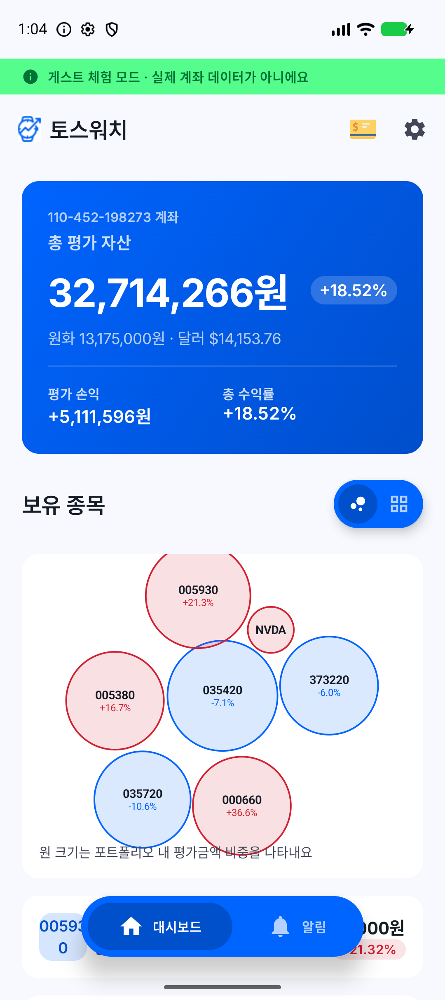
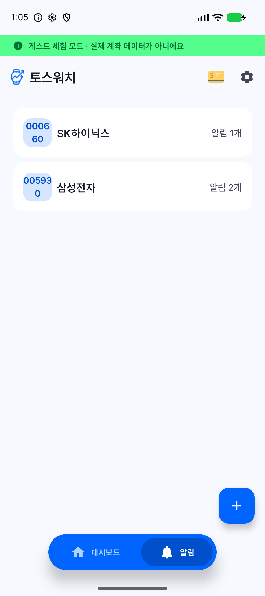
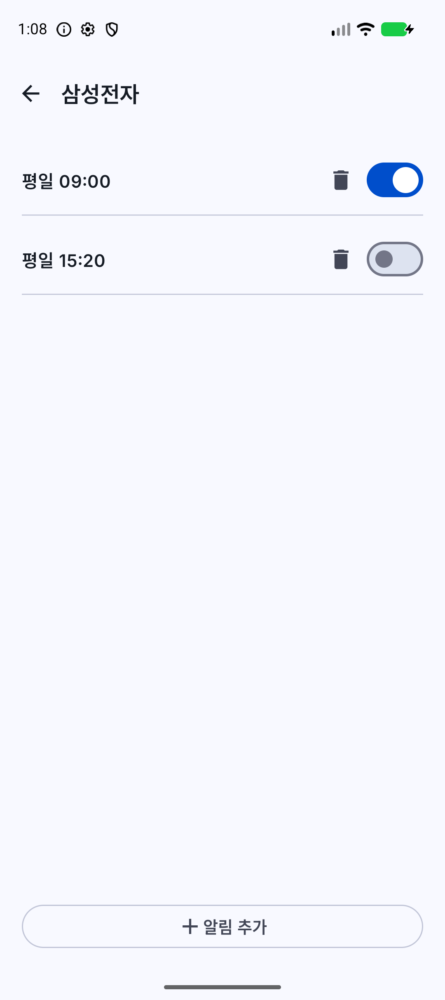
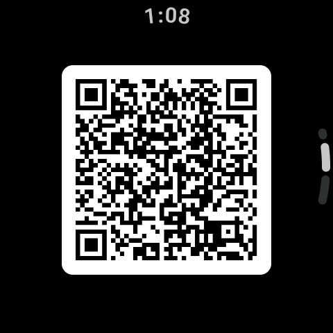
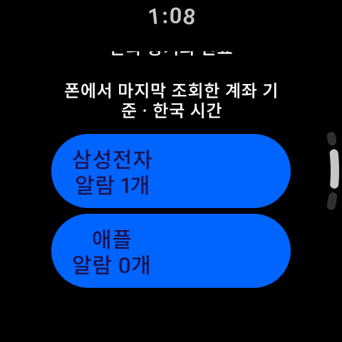
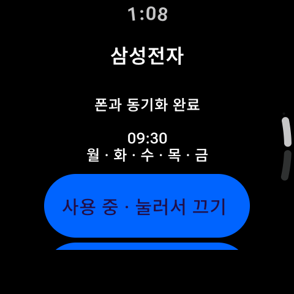
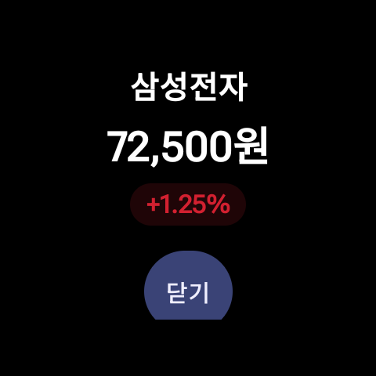
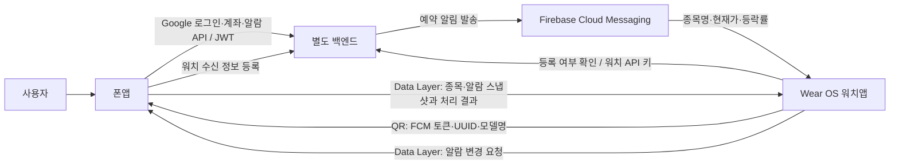
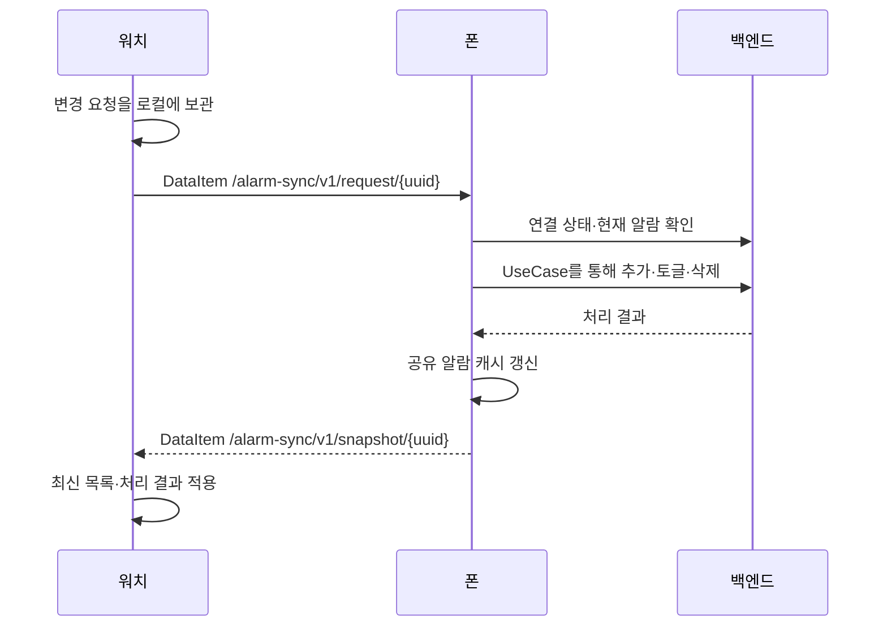

# Toss Watch · 토스워치

**폰에서 보유 주식과 알림 시간을 관리하고, Wear OS 워치에서 주가 알림을 확인하는 Android 프로젝트입니다.**

폰앱은 Google 로그인, 토스증권 Open API 키 등록, 계좌·포트폴리오 조회를 담당합니다. 사용자는 종목별로 알림을 받을 요일과 시간을 설정하고, 워치는 서버가 보낸 종목명·현재가·등락률을 진동과 알림 화면으로 전달합니다. 워치에서도 알람을 추가하거나 켜고 끄고 삭제할 수 있으며, 변경 요청은 연결된 폰을 거쳐 서버에 저장됩니다.

이 저장소에는 **Android 폰앱과 Wear OS 앱**이 들어 있습니다. 계좌·시세 조회, 사용자 인증, 알림 스케줄 실행 및 FCM 발송을 처리하는 백엔드는 별도로 필요합니다. 현재 클라이언트의 알람 모델은 **요일·시간 예약형**이며, 목표가 도달 조건이나 주식 주문 기능은 포함하지 않습니다.

## 화면으로 살펴보기

2026-09-13 Android 에뮬레이터에서 촬영했습니다. 폰 화면은 앱에 내장된 **게스트 샘플 데이터**, 워치 화면은 **실제 Compose 화면에 문서용 샘플 상태를 주입한 instrumentation 캡처**입니다. 실제 계좌·토큰을 사용하지 않았으며, 워치의 ‘동기화 완료’ 표시는 예시 상태입니다. 이 이미지들은 서버 연동이나 FCM 종단 간 수신 테스트의 증거가 아닙니다.

### 폰앱

| 로그인·게스트 체험 | 포트폴리오 대시보드 | 종목별 알림 | 알람 상세 |
|:---:|:---:|:---:|:---:|
|  |  |  |  |

### 워치앱

| QR 연결 | 종목 선택 | 알람 관리 | 주가 알림 |
|:---:|:---:|:---:|:---:|
|  |  |  |  |

워치의 목록 화면은 세로로 스크롤합니다. QR·종목·알람 내용이 보이도록 스크롤한 화면이며, QR에는 실제로 등록할 수 없는 문서용 값만 들어 있습니다. 촬영 환경과 재현 방법은 [스크린샷 안내](docs/screenshots/README.md)를 참고하세요.

## 제공하는 서비스

| 기능 | 폰앱 | 워치앱 |
| --- | --- | --- |
| 계정 시작 | Credential Manager 기반 Google 로그인, 게스트 체험 | 폰이 스캔할 연결 QR 표시 |
| 토스증권 계좌 연동 | 클라이언트 ID·시크릿을 백엔드에 등록 | 폰의 계정 연결 활용 |
| 자산 확인 | 계좌 선택, 총 평가 자산·평가 손익·수익률, 보유 종목, 버블·트리맵 비중 차트 | 폰에서 전달한 종목 목록 확인 |
| 예약 알림 | 종목별 요일·시각 설정, 추가·활성화/비활성화·삭제 | 같은 종류의 관리 요청을 폰에 전송 |
| 알림 수신 | 계정과 워치 수신 정보를 연결 | FCM 수신, 종목명·현재가·등락률 표시, 진동, 닫기·스와이프 |
| 연결 관리 | 등록된 워치 상태 조회, QR 재등록, 로그아웃 | 연결 정보 확인, QR 재생성, 목록 새로고침 |

예를 들어 삼성전자에 ‘월~금 오전 9:30’ 알람을 등록하면, 서비스는 해당 일정의 주가 알림을 워치로 전달하도록 구성됩니다. 워치는 상승·하락·보합에 따른 이미지 장면을 먼저 보여주고 약 2초 뒤 가격 정보로 전환합니다. 실제 발송 시각과 시세의 최신성은 별도 백엔드와 네트워크 상태에 달려 있습니다.

## 폰과 워치는 어떻게 연동하나요?

연동은 **계정에 워치를 등록하는 QR 흐름**, **알람 설정을 주고받는 Data Layer**, **서버에서 워치로 보내는 FCM**으로 나뉩니다.



### 1. QR로 계정과 워치 연결

1. 폰에서 Google 로그인 후 토스 API 키를 등록하고 계좌를 조회합니다.
2. 워치가 FCM 토큰을 발급받고 로컬 UUID를 생성합니다. `fcm_token`, `uuid`, `model_name`을 JSON으로 직렬화하여 QR로 표시합니다.
3. 폰의 설정 → 워치 연결 화면에서 카메라로 QR을 스캔합니다.
4. 폰이 로그인 세션으로 `PUT v1/toss-watch/users/fcm-token/`을 호출해 워치를 사용자 계정에 등록합니다. 현재 API 계약은 **계정당 워치 1개**입니다.
5. 워치는 `POST v1/toss-watch/fcm-token/check/`로 등록 여부를 확인하고, 확인되면 연결 상태를 로컬에 저장해 알람 홈으로 이동합니다. 이 호출은 사용자 JWT 대신 `X-Toss-Watch-Api-Key` 헤더를 사용합니다.

QR 등록은 서비스 계정 연결입니다. 알람 설정 동기화를 위해서는 이와 별도로 **폰과 워치가 Wear OS 기기 페어링을 통해 Data Layer로 통신할 수 있어야 합니다.**

### 2. 폰을 통해 알람 설정 동기화



- 폰의 `PhoneAlarmSyncBridge`가 종목 캐시와 알람 목록을 관찰하여 워치에 전달합니다. 워치 목록은 **폰에서 마지막으로 조회한 계좌 기준**입니다.
- 워치의 알람 CRUD는 직접 REST API를 호출하지 않습니다. `REFRESH`, `ADD`, `TOGGLE`, `DELETE` 요청을 Data Layer로 전달하고, 폰의 UseCase가 인증된 API 호출을 수행합니다.
- 요청 ID와 처리 결과를 저장해 재전송을 처리하고, UUID·세션·스냅샷 순서를 검증합니다. 연결이 끊긴 동안의 변경 요청은 대기 상태로 보관하며 서버 저장 완료와 구분합니다.
- 폰의 알람 목록·상세 화면은 Repository의 단일 `StateFlow` 캐시를 구독하므로, 수정 후 뒤로 돌아가도 변경된 알람 개수가 반영됩니다.
- Data Layer의 알람 계약에는 로그인 JWT나 토스 API 시크릿을 담지 않습니다.

### 3. 서버에서 워치로 주가 알림 전달

백엔드는 등록된 워치 FCM 토큰으로 `stock_name`, `price`, `change_rate` 데이터를 보냅니다. 워치의 `WatchNotificationService`는 높은 중요도의 알람 알림과 전체 화면 Intent를 구성하고, `StockAlarmActivity`가 가격 UI와 진동을 실행합니다. 실제 전체 화면 표시 여부는 알림 권한과 OS·기기 정책에 영향을 받습니다.

이 수신 경로는 폰의 알림 미러링이 아닌 **워치의 직접 FCM 수신**입니다. 워치가 인터넷에 연결되어 있으면 폰 UI를 열어둘 필요는 없습니다. 다만 계정 연결과 알람 설정 변경에는 폰이 필요합니다. 워치의 FCM 토큰 갱신을 서버에 자동 등록하는 처리는 현재 없으므로, 필요할 때 QR을 재생성해 폰에서 다시 등록합니다.

## 프로젝트 구조

멀티 모듈 Clean Architecture와 MVI를 사용합니다. 각 기능은 `presentation → domain ← data`로 나뉘고, UI는 Intent를 ViewModel에 전달하며 UseCase를 통해 상태를 변경합니다.

```text
toss-watch/
├── app/                  # 폰 진입점, Navigation 3, 하단 탭, 워치 동기화
├── watch-app/            # 독립 Wear OS APK, QR 연결, 알람 관리·수신
├── feature/
│   ├── auth/             # Google 로그인, 게스트 진입
│   ├── dashboard/        # 계좌·포트폴리오·차트
│   ├── alarm/            # 종목별 알람 목록·상세와 CRUD
│   ├── setting/          # 설정, 워치 QR 등록, 로그아웃
│   └── tosskey/          # 토스 API 키 등록
├── core/
│   ├── model/            # 도메인 모델, NetworkResult, 워치 통신 계약
│   ├── common/           # MVI 기반 클래스, 코루틴·공통 유틸리티
│   ├── network/          # 폰 Retrofit, 인증 헤더, JWT 자동 갱신
│   ├── datastore/        # 암호화한 폰 세션, 게스트 모드·워치 연결 상태
│   ├── database/         # Room 보유 종목 캐시
│   └── designsystem/     # 폰 공통 테마·UI 컴포넌트
├── docs/screenshots/     # 에뮬레이터 캡처와 재현 안내
└── gradle/libs.versions.toml
```

| 영역 | 사용 기술 |
| --- | --- |
| UI | Jetpack Compose, Material 3, Compose for Wear OS |
| 상태·비동기 | MVI, Kotlin Coroutines, Flow, 불변 UI 상태 |
| DI·탐색 | Hilt, Navigation 3, `@Serializable` 타입 안전 경로 |
| 통신 | Retrofit, OkHttp, Kotlinx Serialization, `NetworkResult` |
| 인증·저장 | Credential Manager, DataStore, Tink AEAD, Android Keystore |
| 캐시·백그라운드 | Room, WorkManager |
| 워치 연결·푸시 | Google Play services Wearable Data Layer, Firebase Messaging |
| QR | ZXing 생성, CameraX·ML Kit 스캔 |

폰 JWT는 Tink AEAD로 암호화한 후 DataStore에 저장하며, 401 응답은 OkHttp Authenticator가 토큰 갱신 후 재시도합니다. 자세한 저장 설계는 [core/datastore/README.md](core/datastore/README.md)에 있습니다.

워치는 자체 Retrofit·Hilt·DataStore 구성을 사용하며 `:core:network`, `:core:datastore`에 의존하지 않습니다. 두 앱은 별도 APK지만 `applicationId`는 `dev.comon.toss_watch`로 같고, 워치 namespace는 `dev.comon.watch_app`입니다. 두 앱의 서명도 일치시켜야 합니다. 릴리스 서명 키는 외부에서 별도로 구성합니다.

## 코드 탐색과 검증

- [공유 워치 통신 계약](core/model/src/main/kotlin/dev/comon/toss_watch/core/model/watch/WatchAlarmSync.kt)
- [폰 알람 동기화 처리](app/src/main/java/dev/comon/toss_watch/watchsync/PhoneAlarmSyncBridge.kt)
- [워치 요청·스냅샷 보관](watch-app/src/main/java/dev/comon/watch_app/data/repository/WatchAlarmRepositoryImpl.kt)
- [폰 QR 등록 ViewModel](feature/setting/src/main/kotlin/dev/comon/toss_watch/feature/setting/presentation/watchpair/WatchPairViewModel.kt)
- [워치 FCM 수신 서비스](watch-app/src/main/java/dev/comon/watch_app/service/WatchNotificationService.kt)

문서 작성 시 폰·워치 `assembleDebug` 및 워치 캡처용 `assembleDebugAndroidTest` 빌드를 확인했습니다. 캡처용 instrumentation 실행은 4개 시나리오로 구성되며, 전체 회귀 테스트나 실제 백엔드·FCM 연동 검증을 대체하지 않습니다.
